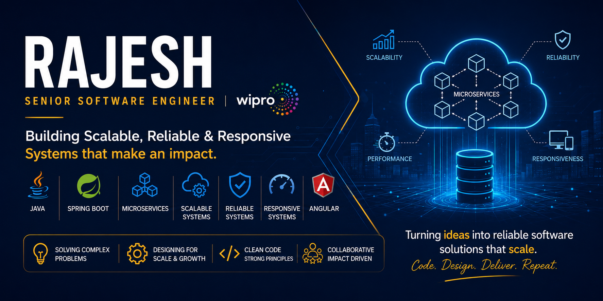

### Hi there, I'm <a href="https://linktr.ee/rajesh_rathore" target="_blank">	𝗥𝗮𝗷𝗲𝘀𝗵 𝗥𝗮𝘁𝗵𝗼𝗿𝗲</a> 

I am a **Full Stack Engineer** with **5+ years of experience** specializing in building highly scalable microservices, resilient distributed systems, and optimized enterprise web/SaaS applications. 

### 🛠️ What I Do
- **Architecting at Scale:** Designing fault-tolerant microservices using **Java Spring Boot** and **Node.js**, backed by **PostgreSQL** and **MongoDB**.
- **Frontend Performance:** Crafting high-performance UIs and modular architectures using **Angular** and **Angular Universal (SSR)**.
- **System Resiliency & Observability:** Implementing robust telemetry and fault-handling using **Prometheus, Grafana, Zipkin, and Resilience4j**.
- **Cloud & DevOps:** Containerizing and orchestring environments using **Docker** and **Kubernetes** with seamless **CI/CD** automation.
---

⚡ *Fun fact: I love breaking down complex business logic into clean, decoupled, and reusable code.*

>I enjoy meeting new people and hearing new perspectives. Reach out if you want to talk to me about emerging tech.

#### 🧰 Languages and Tools

<table border="0">
 <tr>
    <td><b style="font-size:30px"> Languages </b></td>
    <td><b style="font-size:30px"> Frameworks and libraries </b></td>
 </tr>
 <tr>
    <td>
    

    </td>
    <td>
    
    

    </td>
 </tr>
  <tr>
    <td><b style="font-size:30px"> Development tools </b></td>
    <td><b style="font-size:30px"> Database </b></td>
 </tr>
  <tr >
    <td>
    

	
    </td>
    <td>
    

    </td>
 </tr>
</table>

  
    
**Talking about Personal Stuffs:**

- 👨🏻‍💻 I’m currently working on something cool [Check it out](https://raj-rathod.github.io/DSA-visualisation-in-angular/);
- 🚀 I’m currently learning Data Structures and Algorithms on [Hackerrank](https://www.hackerrank.com/Raj_Rathod_1313);
- 💬 Ask me about anything, I am happy to help;
- 📫 How to reach me: rajeshrathore05011998@gmail.com;
- 📝 [Resume](https://drive.google.com/file/d/17HzCJ04dLa2X4U8ShwTupqYMKsmCI2kG/view?usp=sharing).

**Check My Work:**
- [Data Structure and Algorithm Visualization(DSA)](https://raj-rathod.github.io/DSA-visualisation-in-angular/)
- [Data Structure and Algorithm Methods (NPM Package)](https://www.npmjs.com/package/@raj-rathod/dsa-methods)
- [Calendar Without Api](https://raj-rathod.github.io/Calendar_without_Third_Party_api/)
- [Tic Tac Toe Game](https://raj-rathod.github.io/tic-toc-game/)
- [Shortest Path Finding](https://dsa-visualization.github.io/shortest-path-finding/)

##
 
### 📊 My Github Stats
 

